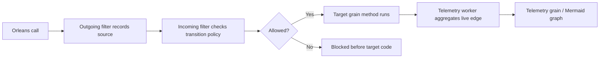

# ManagedCode.Orleans.Graph

## Trigger On

- integrating `ManagedCode.Orleans.Graph` into an Orleans-based system
- enforcing which grain interfaces may call other grain interfaces and methods
- detecting unsafe runtime grain call cycles or intentional self-reentrancy
- generating configured-policy or live-call Mermaid diagrams
- running observe mode to discover real traffic before locking down a policy

## Install

Current upstream release reviewed: `v10.0.3`.

```bash
dotnet add package ManagedCode.Orleans.Graph
```

The upstream package targets the current .NET 10 / Orleans 10 stack. Do not add it to older Orleans applications without first checking target frameworks and Orleans package compatibility.

## Workflow

1. Confirm the application needs grain-call policy enforcement or live-call diagnostics. If the task is generic graph data traversal, use normal Orleans grain modeling instead.
2. Register Orleans.Graph filters in the silo with `AddOrleansGraph(...)`.
3. Model the policy from source grain to target grain and method. Start with explicit allow rules for client entry points and grain-to-grain transitions.
4. Use `AllowAll()` observe mode only to discover traffic before enforcement. Keep a follow-up step to convert observed edges into reviewed policy.
5. Register the client-side outgoing filter with `clientBuilder.AddOrleansGraph()` only when Orleans clients should participate in call-history tracking.
6. Use attributes when colocating policy with grain contracts is clearer than central fluent setup.
7. Generate Mermaid diagrams and inspect policy edges for review artifacts.
8. Validate with real Orleans runtime tests, including timer, reminder, hosted-service, and stateless-worker call origins when those are part of the topology.



## Practical Usage

### Enforce a grain transition

```csharp
using ManagedCode.Orleans.Graph.Extensions;

siloBuilder.AddOrleansGraph(graph =>
{
    graph.AllowClientCallGrain<IOrderGrain>();

    graph.AddGrainTransition<IOrderGrain, IPaymentGrain>()
        .Method(
            source => source.SubmitAsync(GraphParam.Any<Order>()),
            target => target.ChargeAsync(GraphParam.Any<Payment>()))
        .And();

    graph.AddGrain<IPaymentGrain>()
        .WithReentrancy();
});
```

### Discover traffic before enforcement

```csharp
siloBuilder.AddOrleansGraph(
    configureFilters: filters =>
    {
        filters.LiveGraphFlushPeriod = TimeSpan.FromSeconds(1);
    },
    configureGraph: graph =>
    {
        graph.AllowAll();
    });

clientBuilder.AddOrleansGraph();
```

After the app receives traffic, inspect the observed graph:

```csharp
var telemetry = grainFactory.GetGrain<IOrleansGraphTelemetryGrain>(
    Constants.LiveGraphTelemetryGrainKey);

var observedGraph = await telemetry.GetObservedGraphAsync();
var mermaid = await telemetry.GenerateLiveMermaidDiagramAsync();
```

### Use attributes on grain contracts

```csharp
using ManagedCode.Orleans.Graph.Attributes;

[AllowClientCall]
[AllowGrainCall(
    typeof(IPaymentGrain),
    AllowAllMethods = false,
    SourceMethods = [nameof(IOrderGrain.SubmitAsync)],
    TargetMethods = [nameof(IPaymentGrain.ChargeAsync)])]
public interface IOrderGrain : IGrainWithStringKey
{
    Task SubmitAsync(Order order);
}

[AllowSelfReentrancy]
public interface IPaymentGrain : IGrainWithStringKey
{
    Task ChargeAsync(Payment payment);
}
```

## Options And Constraints

- `AllowAll()` is an observe/discovery mode, not a finished production policy.
- `AllowClientCallGrain<T>()` is required for client-originated entry points that should be allowed.
- `TrackOrleansGraphInternalCalls` should stay off unless debugging Orleans.Graph itself.
- `RegisterGrainTimer` callbacks use `*` as the source method because Orleans does not expose a grain interface method for that callback.
- Reminder callbacks use the source grain identity and `ReceiveReminder` as the source method.
- Runtime vertices use exact graph identities. The library records `ORLEANS_GRAIN_CLIENT` for client calls and `UNKNOWN_CALLER` when Orleans exposes no resolvable caller identity.
- `v10.0.3` includes fixes for reminders and timers; re-test those origins when upgrading.

## Deliver

- explicit Orleans.Graph registration for the silo and, when needed, clients
- reviewed allow rules for client-to-grain and grain-to-grain transitions
- observe-mode output or Mermaid diagrams when discovering real call paths
- validation coverage for blocked transitions, allowed transitions, self-reentrancy, and runtime graph diagnostics

## Validate

- the app needs call policy enforcement, not generic graph traversal
- every client entry point and grain transition required by the workflow is allowed intentionally
- missing or unexpected transitions fail before target grain code runs
- observe-mode findings are converted into reviewed policy before production enforcement
- timer, reminder, hosted-service, stateless-worker, and client-originated calls are covered when they exist
- Mermaid or edge snapshots are generated from runtime traffic or configured policy and reviewed for cycles
