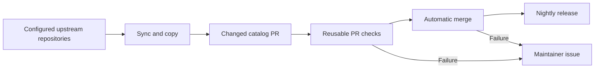

# Nightly source synchronization

## Contract

Copy skills and agents from known upstream repository layouts through vendir and
the canonical importer. Run nightly, create one PR only for catalog changes,
validate the exact commit, merge automatically, and publish unreleased content
through the existing 04:00 UTC release. Issues are only for failed automation,
including a refused merge. No AI provider is required.

## Checklist

- [x] Remove AI rewriting and provider setup from code and documentation.
- [x] Reuse vendir/importer source-layout discovery and verbatim copy behavior.
- [x] Keep watches, scoped PRs, exact-commit checks and failure-only issues.
- [x] Verify local regressions and workflow syntax (41 tests and actionlint).
- [x] Push directly to main and execute the nightly workflow.
- [x] Verify automatic PR and merge: PR #1580, Actions run 34874471959.
- [x] Verify the release path: Actions run 34875037756 published catalog-v2026.9.14.0,
  pushed all three NuGet tools as 0.1.223, and deployed GitHub Pages.

## Evidence

Regression coverage includes canonical upstream layouts, excluded skills,
verbatim imports, repeated/no-op publication, changed head/base rejection,
GitHub merge refusal and failure reporting. Live Actions results establish
runtime behavior; local passing tests alone do not prove automatic delivery.

The live refresh run passed watch, both reusable validation jobs, automatic merge
and baseline promotion. Release failures are reported separately, and the public
catalog release is finalized only after NuGet publication and asset upload.

A second release run (34875377877) confirmed the unchanged revision is a no-op:
release packaging, NuGet push and Pages deployment were skipped successfully.
No-op runs do not close an earlier release failure issue because they do not
prove that its failed publish or Pages stage has recovered.
