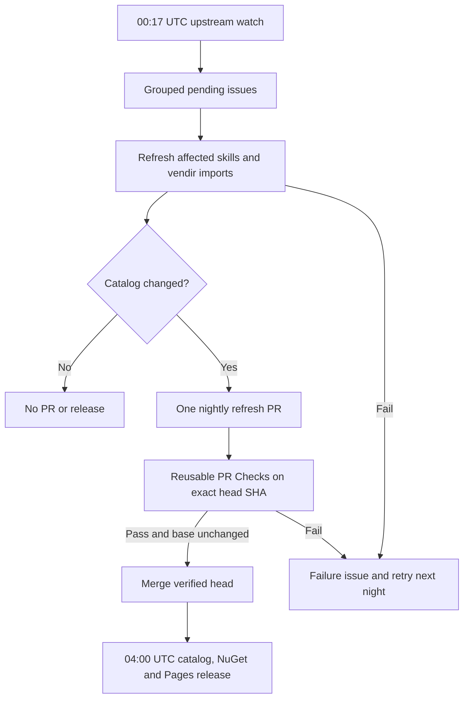

# Nightly catalog refresh

## Contract

Run upstream monitoring and catalog refresh at 00:17 UTC. Keep grouped upstream
issues as the durable retry queue. Import external skills verbatim; refresh
repo-owned guidance only from configured authoritative sources. Create one
automation PR for real catalog changes. Validate its immutable head through the
same catalog, Waza, build, test, pack, and smoke checks as normal PRs. Merge only
that head, only while its base is still current. The 04:00 UTC release publishes
unreleased commits; an unchanged night produces neither a PR nor a release.

## Implementation checklist

- [x] Replace manual-only maintenance policy with nightly validated automation.
- [x] Implement durable pending-work selection and scoped skill refresh.
- [ ] Connect the selected content provider and verify a real repo-owned skill refresh; provider choice and credential are pending.
- [x] Implement idempotent PR creation, immutable-head merge and failure issues.
- [x] Reuse PR checks and lock vendir verification to committed snapshots.
- [x] Document updater contract, no-op behavior, retries and release ordering.
- [ ] Document and wire the selected provider credential.
- [ ] Run regression tests, catalog/watch validation, workflow lint and live dry run.
- [ ] Commit, push, and verify the GitHub workflow against the delivered revision.

## Validation matrix

Regression tests cover no changes, state-only changes, repeated pending issues,
imported ownership, unknown skills, refresh failure, unsafe output paths, PR reuse,
changed PR head/base and deduplicated failure reporting. Check workflow syntax with
actionlint. Run Python regression tests and source validators. Run real PR Checks
remotely to cover Waza and .NET packaging. Provider-dependent work requires the
selected provider credential; never report mocked output as a live AI refresh.

## Design decisions

Use one shared runner instead of copying the same updater into every skill.
Skill-specific behavior, when necessary, belongs alongside that skill. Existing
watch mappings select affected skills. Watch cache is observation state; open
issues are unfinished work, so advancing the cache cannot lose failed refreshes.
Bot PRs explicitly invoke reusable checks instead of relying on recursive
`GITHUB_TOKEN` events to start CI.
