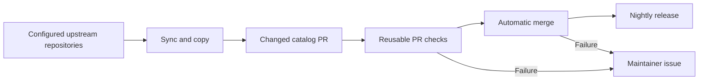

# Nightly source synchronization

## Contract

Copy skills and agents from known upstream repository layouts through vendir and
the canonical importer. Run nightly, create one PR only for catalog changes,
validate the exact commit, merge automatically, and publish unreleased content
through the existing 04:00 UTC release. Issues are only for failed automation,
including a refused merge. No AI provider is required.

## Checklist

- [x] Remove AI rewriting and provider setup from code and documentation.
- [x] Reuse vendir/importer source-layout discovery and verbatim copy behavior.
- [x] Keep watches, scoped PRs, exact-commit checks and failure-only issues.
- [ ] Verify local regressions and workflow syntax.
- [ ] Push directly to main and execute the nightly workflow.
- [ ] Verify real automatic PR/merge or no-op outcome and release path.

## Evidence

Regression coverage includes canonical upstream layouts, excluded skills,
verbatim imports, repeated/no-op publication, changed head/base rejection,
GitHub merge refusal and failure reporting. Live Actions results establish
runtime behavior; local passing tests alone do not prove automatic delivery.
