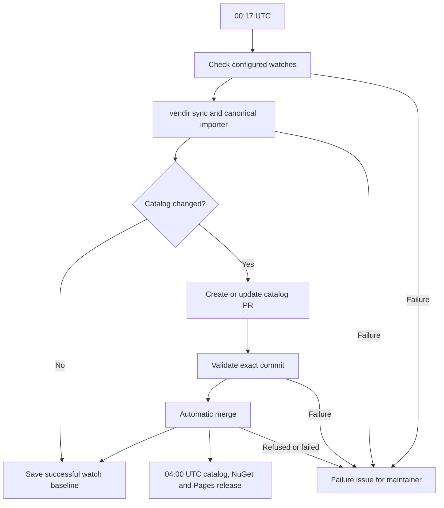

# Nightly catalog refresh

At **00:17 UTC**, `upstream-watch.yml` checks every configured release and
 documentation watch, synchronizes upstream repositories, copies their skill and
agent trees, and opens or updates one catalog PR when catalog content changes.
The same PR Checks validate the proposed commit before automatic merge. At
**04:00 UTC**, `publish-catalog.yml` publishes unreleased changes as catalog assets,
NuGet tools and GitHub Pages. Scheduled start times may be delayed by GitHub.

## Source configuration

- `external-sources/vendir.yml` specifies upstream repositories, refs, included
  directories and source roots.
- `external-sources/vendir.lock.yml` records the resolved commits.
- `external-sources/imports/*.json` contains catalog placement and import overrides.
- The importer discovers `plugin.json`, `.claude-plugin/plugin.json`, and
  `.agents/skills/*/SKILL.md` source layouts. It copies upstream Markdown verbatim.
- All configured import repositories are synced every night, even if their
  watched release or documentation page has not changed.
- Release/documentation watches are change signals. A source must have an actual
  skill tree and an import mapping to supply copied skill content.

No AI service, model, or content-generation command is part of this workflow.
GitHub operations use the workflow's `GITHUB_TOKEN`.

## Validation and automatic delivery

`catalog-check.yml` runs Python regression tests, locked vendir/import verification,
catalog and agent validation, Waza, .NET build, tests, pack and install smoke tests.
Locked verification preserves the committed lock metadata while checking its
exact source commits. The merge job checks that both PR head and base still match
the validated revision. It does not bypass repository protection.

The automation PR uses `codex/nightly-catalog-refresh`. Successful changes merge
without manual intervention. A conflict, failed check, permission error, or refused
merge produces a `nightly-refresh-failure` issue with the run link and failure
context so the maintainer can intervene. Release or Pages failures create a
separate `nightly-release-failure` issue. Recovery closes only the corresponding
failure issue. Catalog releases are published after NuGet succeeds, and their
assets and Pages build use the same source commit.



Normal upstream changes never create issues. An unchanged catalog creates no PR;
a revision already released creates no duplicate release. Watch state is saved
outside Git only after successful merge or validated no-op, so failed work is
retried next night. A cache miss rechecks from the checked-in bootstrap baseline.
Reports are retained as Actions artifacts for seven days.

## Local verification

```bash
python3 scripts/upstream_watch.py --validate-config
python3 scripts/upstream_watch.py --dry-run
bash scripts/sync_external_catalog_sources.sh
python3 scripts/generate_catalog.py --validate-only
python3 scripts/generate_agent_catalog.py --validate-only
python3 -m unittest discover -s scripts/tests -p 'test_*.py'
```

CI invokes `bash scripts/sync_external_catalog_sources.sh --locked` to verify the
committed snapshot. To add another upstream skill tree, extend the vendir transport
configuration and its import overrides, then run this same validation flow.
